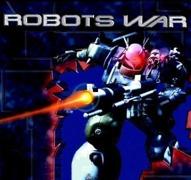



## RobotsWar

### Description

An example of arcade / strategy game.

Two teams of robots are figthing to each other.

You are the Commander of the MechWarriors while

the Computer leads the MetalKnights.

The purpose of the game is only one: WIN!

See the Readme.txt and Instructions.txt files.

I would appreciate it if you give me feedback.

DX7 needed. The zip file is about 1.4 Mb, so

be patient when downloading.

For other vb games and demos visit my web site: http://web.tiscali.it/fc_vbgames/index.html
 
### More Info
 
DirectX7

             |
---                |---
**Submitted On**   |2001-10-19 08:05:44
**By**             |[fabio calvi](https://github.com/Planet-Source-Code/PSCIndex/blob/master/ByAuthor/fabio-calvi.md)
**Level**          |Advanced
**User Rating**    |4.9 (54 globes from 11 users)
**Compatibility**  |VB 6\.0
**Category**       |[Games](https://github.com/Planet-Source-Code/PSCIndex/blob/master/ByCategory/games__1-38.md)
**World**          |[Visual Basic](https://github.com/Planet-Source-Code/PSCIndex/blob/master/ByWorld/visual-basic.md)
**Archive File**   |[RobotsWar3091910242001\.zip](https://github.com/Planet-Source-Code/fabio-calvi-robotswar__1-28387/archive/master.zip)

